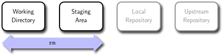

# Uncommon Commands

### Remove



To remove a file from Git, you have to remove it from your **staging area** and then commit. The command `rm` command does that, and also removes the file from your **working directory** so you don’t see it as an untracked file the next time around.
If you simply remove the file from your **working directory**, it shows up under the "Changed but not updated" (that is, unstaged) area of your `git status` output.

If you want to keep the file in your **working directory** but remove it from your **staging area** (in other words, you want to keep the file on your hard drive but not have Git track it anymore), use the `--cached` option with the `rm` command.

```bash
$ git rm --cached file_to_remove.txt
```

### Log


After you have cloned a **upstream repository** with an existing commit history, you probably want to look back to see what has happened. The tool to do this is the `log` command.
By default, with no arguments, the `log` command lists the commits made in your **local repository** in reverse chronological order –- that is, the most recent commits show up first:


```bash
$ git log
```
