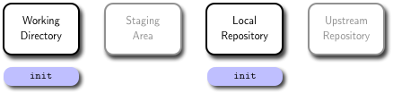

# Git Basics

The first thing to understand about Git is that the contents of your project are stored in several different states and forms at any given time. If you think about what version control is, this might not be surprising: in order to remember every change that's ever been made, you need to store a record of those changes somewhere, and to be able to handle multiple people changing the same code, you need to have different copies of the project and a way to combine them.

You can think about it operating on four different areas:


* The **working directory** is what you are currently looking at in you local machine. When you use an editor to modify a file, the changes are made to the **working directory**.

* The **staging area** is a place to collect a set of changes made to your project. If you have changed three files to fix a bug, you will add all three to the **staging area** so that you can remember the changes as one historical entity.

* The **local repository** (or _local repo_) is the place where Git stores everything you've ever done to your project. Even when you delete a file, a copy is stored in the **local repository** (this is necessary for always being able to undo any change). It is important to note that a **local repository** does not look much at all like your project files or directories. Git has its own way of storing all the information, and if you're curious what it looks like, look in the `.git` directory in the **working directory** of your project.

* The **upstream repository** (or _remote repository_ or _remote repo_) allows everyone to agree on a single version of the project. When working in a team, every member will be working on their own **local repository**. If two people have made changes on their **local repositories**, they will combine those changes in the **upstream repository**.

You can think of most Git operations as moving code or metadata from one of these areas to another.

# Common Commands

Git commands are passed as arguments to the `git` program. For example, if you want to run the status command you'll see later, you run it like this:

```bash
$ git status
```

## Init



If you want to start tracking an existing **working directory** in Git, you need to initialize the staging area and the local repository. The command `init` creates a new subdirectory named `.git` in the **working directory** that contains all of your necessary **local repository** files. At this point, nothing in your project is tracked yet; in particular, no **staging area** and **upstream repository** are created or available.

```bash
$ cd some-folder
$ git init
````

## Clone


Cloning a repository does two things: it takes a repository from somewhere (usually an **upstream repository**) and makes a local copy (your new **local repository**), and it creates the most recent copy of all of the files in the repository in your new **working directory**. Using the `clone`command is generally how you will start working on a project for the first time.

```bash
$ git clone https://github.com/tonellotto/cloud-computing
```

## Status


The `status` command is your window into the current state of your project in your **working directory**. It tells you which files you have changed and which files you currently have in your **staging area**.

```bash
$ git status
```

## Add


When you have made a change to a set of files and are ready to create a _commit_, the first step is to add all of the changed files to the **staging area**. The `add` command does that. Remember that what you see in the filesystem is your **working directory**, so the way to see what is in the **staging area** is with the `status` command. This also means that if you add something to the **staging area** and then edit it again, you'll also need to add the file to the **staging area** again if you want to remember the new changes.

```bash
$ git add new_file.txt
```

## Commit


When you're satisfied with the changes you haveve added to your **staging area**, you can commit those changes to your **local repository** with the `commit` command. Those changes will have a permanent record in the **local repository** from now on.

```bash
$ git commit -m "commit message"
```

Every commit has two features you should be aware of. The first is a *hash*. This is a unique identifier for all of the information about that commit, including the code changes, the timestamp, and the author. The second is a *commit message*. This is text that you can (and should) add to a commit to describe what the changes were.

Commit messages are a way of quickly telling your future self (and your collaborators) what a commit was about. For even a moderately sized project, digging through tens or hundreds of commits to find the change you're looking for is a nightmare without friendly summaries.

By convention, commit messages start with a single-line summary, then an empty line, then a more comprehensive description of the changes.

## Push


The `push` command takes the changes you have made to your **local repository** and attempts to update a **remote repository** with them. If you're the only person working with both of these (which is how a solo GitHub project would work), then push should always succeed.
If you're working with other people, then it's possible that they have made changes to the **remote repository **between the time you first cloned it and now. The `push` command will fail. That's where the next two commands come in.

```bash
$ git push
```

## Fetch


Let's say a collaborator has pushed changes to your shared **upstream repository** while you were editing. Their **local repository** and the **upstream repository** now both contain their changes, but your **local repository** does not. To update your **local repository**, you run the `fetch` command.

But what if you've committed changes in the meantime? Does your **local repository** contain your changes or theirs? The answer is that it contains a record of both, but they are kept separate. Remember that Git repositories are not copies of your project files. They store all the contents of your files, along with a bunch of metadata, but in its own internal format. This is one of the reasons.

Let's say that you and your collaborator both edited the same line of the same file at the same time in different ways. On your respective machines, you both add and commit your different changes, and your collaborator pushes theirs to the **upstream repository**. When you run the `fetch` command, Git adds a record of their changes to your **local repository** alongside your own. These are called *branches*, and they represent different, coexisting versions of your project. The `fetch` command adds your collaborator's branch to your **local repository**, but keeps yours as well.

```bash
$ git fecth
```

## Merge


Having multiple branches is fine, but at some point, you'll want to combine the changes that you've made with those made by others. This is called *merging*.

There are two general cases when merging two branches: first, the two branches are different but the changes are in unrelated places; and second, the two branches are different and the changes are in the same locations in the same files.

The first scenario is easy. Git will simply apply both sets of changes to the appropriate places and put the resulting files into the **staging area** for you. Then you can commit the changes and push them back to the **upstream repository**. Your collaborator does the same, and everyone sees everything.

The second scenario is more complicated. Let's say the two changes set some variable to different values. Git can't know which is the correct value. One solution would be to simply use the more recent change, but this very easily leads to self-inconsistent programs. A more conservative solution, and the one Git uses, is to simply leave the decision to the user. When git detects a *conflict* that it cannot resolve, the `merge` command fails, and Git places a modified version of the offending file in your **working directory**. This is important: the file that Git puts into your directory is not actually either of the originals. It is a new file that has special markings around the locations that conflicted.

Example:
```bash
$ git merge
```

The line above the `=======` belongs to your branch, and the line below belongs to the branch you're merging with. Your job is to edit this file to replace all of that block with just the correct output

Once you have fixed the file, you can `add`, `commit`, and `push` the changes. When your collaborator merges your resolved version, Git is smart enough to know that a merge resolution occurred and how to handle it without causing another conflict, despite the fact that your resolved version was different than either of the originals.

## Pull

