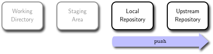
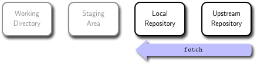

# Branching

A *branch* in Git is simply a pointer to one of the *commit object*s created in your **local repository** when you make a commit. When you initialize a **local repository** with the Git `init` , a default branch is created with the name `master`. Every time you commit, the `master` branch moves forward automatically.
The `master` branch in Git is not a special branch. It is exactly like any other branch.

## Create branches


To create a new branch in your **local repository** with a given name use the `branch` command:

```bash
$ git branch new-branch
```

It is important to note that the `new-branch` branch is not *active*. If you make changes, they will still apply to the `master` branch, not the `new-branch` branch. To change this, you need the next command.

## Checkout branches


Checkout switches the active branch. Since branches can have different changes, checkout may make the **working directory** look very different. For instance, if you have added new files to one branch, and then check another branch out, those files will no longer show up in the **working directory**. They are still stored in the `.git` folder, but since they only exist in the other branch, they cannot be accessed until you check out the original branch.

To switch to an existing branch, you run the checkout command.

```bash
$ git checkout new-branch
```
This means the changes you make from this point forward on the `new-branch` branch will diverge from other branches' versions of the project, in particular the `master` branch.

To create a branch and switch to it at the same time, you can run the checkout command with the `-b` switch:

```bash
$ git checkout -b new-branch
```

This is a shorthand for:
```bash
$ git branch new-branch
$ git checkout new-branch
```

## Showing branches


The `branch` command without arguments simply lists all of the branches in your **local repository**.

```bash
$ git branch
```

If you run it without having created any branches, it will list only one, called `master`.
The `*` character that prefixes the master branch indicates the branch that you currently are working on. This means that if you commit at this point, the master branch will be moved forward with your new work. To see the last commit on each branch, you can run

```bash
git branch -v
```


## Merging branches

Merging branches is perhaps the most diffult operation on Git. Let assume we have worker on a project, creating three commits on the default `master` branch. Every commit contains a pointer to the previous branch in time.


Now we create a new branch `hotfix` and we start working on that branch, creating new commits. When we want to merge back the `hotfix` branch into the `master` branch, two different situations can occur.

1. The `master` branch has not diverged, i.e., no new commits have been created on `master` after the creation of `hotfix`. In other words, there is a linear path between branches that you want to merge.

    ```bash
    $ git checkout master                   # Switched to branch 'master'
    $ git commit -a -m 'fixes'              # Committed change to branch 'master' (C2)
    $ git checkout -b hotfix                # Created and switched to new branch 'hotfix'
    $ nano index.html                       # Made some changes in branch 'hotfix'
    $ git commit -a -m 'made some changes'  # Committed change to branch 'hotfix' (C3)
    ```

    

    In this case a **fast-forward merge** can occur: instead of creating a new commit, the merge will just point `master` to the latest commit of the `hotfix` branch. All commits from `hotfix` branch are now available in `master`.

    ```bash
    $ git checkout master  # Switched to branch 'master'
    $ git merge hotfix     # Fast-forward merge of the 'hotfix' source branch
                           # into # the 'master' destination branch
    ```

    

2.  The `master` branch has diverged, i.e.,  new commits have been created on `master` after the creation of `hotfix`. In other words, there is not a linear path to the target branch.

    ```bash
    $ git checkout master                   # Switched to branch 'master'
    $ git commit -a -m 'fixes'              # Committed change to branch 'master' (C2)
    $ git checkout hotfix                   # Created new branch 'hotfix'
    $ nano index.html                       # Made some changes in branch 'master'
    $ git commit -a -m 'made some changes'  # Committed change to branch 'hotfix' (C4)
    $ git checkout hotfix                   # Switched to branch 'hotfix'
    $ nano index.html                       # Made some changes in branch 'hotfix'
    $ git commit -a -m 'made some changes'  # Committed change to branch 'hotfix' (C3)
    ```


    

    Git has no choice but to combine them via a **three-way merge**. This merge uses an extra commit to tie together the two branches.

    

    ```bash
    $ git checkout master  # Switched to branch 'master'
    $ git merge hotfix     # Fast-forward merge of the 'hotfix' source branch
                           # into # the 'master' destination branch (C5)
    ```

    When Git detects a *conflict* that it cannot resolve, the `merge` command fails.
    Once you have fixed the conflicting file(s), you can add, commit, and push the changes.

## Pushing branches



When you want to share a branch with the world, you need to push it up to a **upstream repository** that you have write access to. Your local branches aren’t automatically synchronized to the **upstream repository** you write to - you have to explicitly push the branches you want to share. That way, you can use private branches for work you don’t want to share, and push up only the topic branches you want to collaborate on.
If you have a branch named `serverfix` that you want to work on with others, you can push it up the same way you pushed your first branch.

```bash
 $ git push origin serverfix
 ```

## Fetching branches



The next time you fetch from a **upstream repository**, you will get a reference to where the server’s version of your current branch, e.g., `serverfix`, is under the remote branch `origin/serverfix`:

```bash
$ git fetch origin
```

It is important to note that when you do a fetch that brings down new remote branches, you do not automatically have local, editable copies of them. In other words, in this case, you do not have a new `serverfix` branch – you only have an `origin/serverfix` pointer that you cannot modify.

If you want your own `serverfix` branch that you can work on, you can base it off your remote branch.

```bash
$ git checkout -b serverfix origin/serverfix
```

This gives you a local branch that you can work on that starts where `origin/serverfix` is.